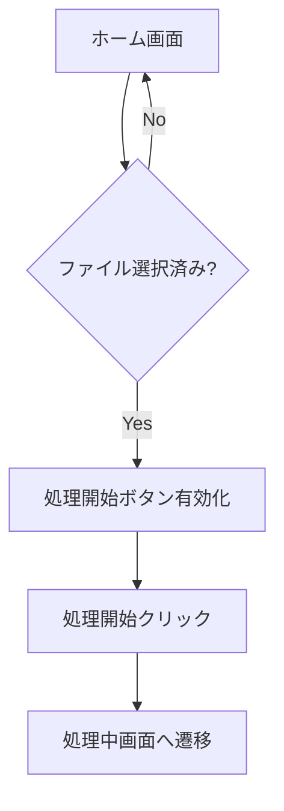
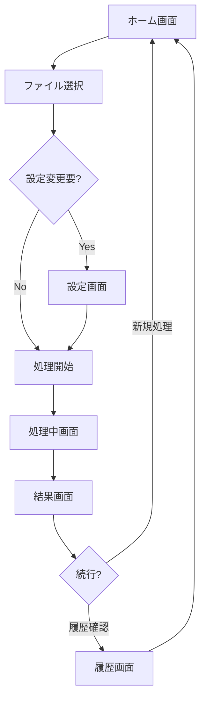
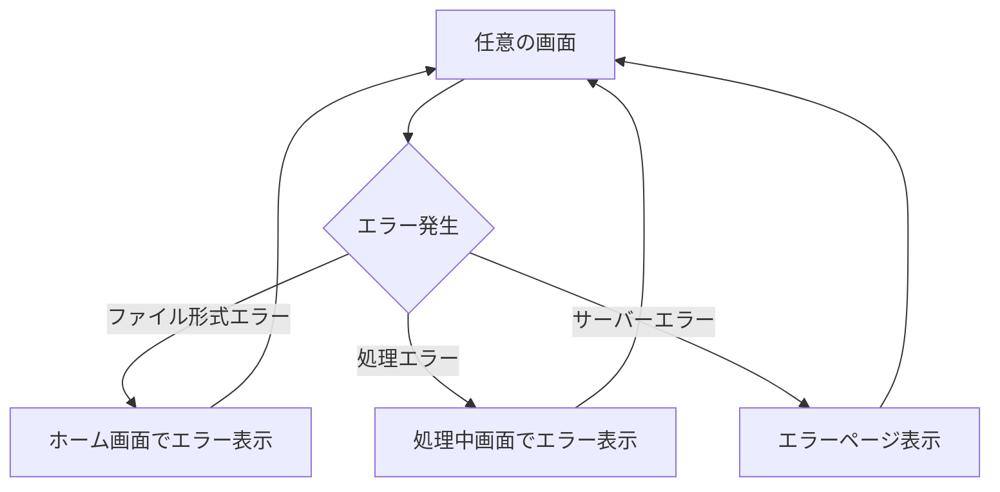

# 画面遷移設計（Web UI）

## 概要
PresidioPDF Web UIの画面遷移とユーザーフローを定義する。シンプルで直感的な操作を重視し、技術者・非技術者両方が迷わずに使用できる設計とする。

## 画面構成概要

### 画面一覧
1. **ホーム画面** (`/`) - ファイルアップロードとクイックスタート
2. **設定画面** (`/config`) - 処理設定の詳細カスタマイズ
3. **処理中画面** (`/processing/<id>`) - リアルタイム処理進捗表示
4. **結果画面** (`/result/<id>`) - 検出結果表示とダウンロード
5. **履歴画面** (`/history`) - 過去の処理履歴一覧
6. **ヘルプ画面** (`/help`) - 使用方法とFAQ

## 詳細画面設計

### 1. ホーム画面 (`/`)

#### レイアウト構成
```
┌─────────────────────────────────────┐
│ PresidioPDF Header                  │
├─────────────────────────────────────┤
│                                     │
│   [ファイルドラッグ＆ドロップエリア]         │
│   または [ファイル選択ボタン]              │
│                                     │
│   ┌─ クイック設定 ─────────────┐        │
│   │ ○ spaCyモデル: [sm▼]      │        │
│   │ ○ マスキング: [annotation▼] │        │
│   │ [詳細設定...]               │        │
│   └────────────────────────┘        │
│                                     │
│   [処理開始]  [履歴を見る]               │
│                                     │
└─────────────────────────────────────┘
```

#### 機能要素
- **ファイルアップロード**
  - ドラッグ&ドロップ対応
  - 複数ファイル選択（将来対応）
  - ファイル形式検証（PDF以外はエラー表示）
  - ファイルサイズ制限（50MB）

- **クイック設定**
  - spaCyモデル選択（sm/md/lg/trf）
  - マスキング方法（annotation/highlight/both）
  - 詳細設定へのリンク

#### 状態遷移


### 2. 設定画面 (`/config`)

#### 設定項目
```
┌─── 基本設定 ──────────────────┐
│ ○ spaCyモデル                │
│   ◉ ja_core_news_sm (推奨)   │
│   ○ ja_core_news_md         │  
│   ○ ja_core_news_lg         │
│   ○ ja_core_news_trf        │
│                             │
│ ○ マスキング方法              │
│   ◉ アノテーション            │
│   ○ ハイライト              │
│   ○ 両方                   │
└─────────────────────────┘

┌─── 検出対象 ─────────────────┐
│ ☑ 個人名                    │
│ ☑ 住所                     │
│ ☑ 電話番号                 │
│ ☑ メールアドレス             │
│ ☐ クレジットカード番号        │
│ ☐ マイナンバー              │
└─────────────────────────┘

┌─── 出力設定 ─────────────────┐
│ ☑ 元ファイル保持             │
│ ☑ 処理レポート生成           │
│ ○ 出力フォルダ: [選択...]    │
└─────────────────────────┘
```

#### 画面遷移
- **戻る**: ホーム画面へ
- **設定保存**: 設定を保存してホーム画面へ
- **リセット**: デフォルト設定に戻す

### 3. 処理中画面 (`/processing/<id>`)

#### 進捗表示
```
┌─────────────────────────────────────┐
│ ファイル処理中... [×]キャンセル         │
├─────────────────────────────────────┤
│ ファイル名: document.pdf             │
│ 進捗: ██████████░░ 65%              │
│                                     │
│ 現在の処理:                          │
│ ✓ ファイル読み込み完了                │
│ ✓ spaCyモデル読み込み完了             │
│ → ページ 3/5 を解析中                │
│   マスキング処理待ち                  │
│                                     │
│ 検出済み個人情報: 12件                │
│ └─ 個人名: 5件                      │
│ └─ 住所: 3件                       │
│ └─ 電話番号: 4件                    │
│                                     │
│ 処理時間: 00:01:23                  │
└─────────────────────────────────────┘
```

#### リアルタイム更新
- WebSocketによる進捗の即座反映
- 検出エンティティ数のリアルタイム表示
- エラー発生時の詳細メッセージ表示

### 4. 結果画面 (`/result/<id>`)

#### 結果表示レイアウト
```
┌─── 処理結果 ──────────────────────────┐
│ ✓ 処理完了 (処理時間: 00:02:15)         │
│                                      │
│ 検出結果サマリー:                       │
│ ├─ 総検出数: 15件                      │
│ ├─ 個人名: 6件                        │
│ ├─ 住所: 4件                         │
│ ├─ 電話番号: 3件                      │  
│ └─ メールアドレス: 2件                  │
│                                      │
│ [処理済みPDFダウンロード] [レポートDL]    │
│ [元ファイルDL] [新しい処理を開始]         │
└─────────────────────────────────────┘

┌─── 検出詳細 ──────────────────────────┐
│ 📄 ページ 1                           │
│ ┌─ 個人名: "田中太郎" (信頼度: 95%)      │
│ │  位置: (150, 200) サイズ: 60x15     │
│ └─ 住所: "東京都..." (信頼度: 87%)      │
│                                      │
│ 📄 ページ 2                           │
│ ┌─ 電話番号: "03-1234-5678" (95%)     │
│ └─ メール: "test@example.com" (98%)   │
└─────────────────────────────────────┘
```

#### インタラクション機能
- **プレビュー機能**: 検出箇所のPDFプレビュー表示
- **ダウンロード**: 処理済みファイル、レポート、元ファイル
- **詳細表示**: 各検出項目の詳細情報とページ位置
- **フィードバック**: 誤検出の報告機能

### 5. 履歴画面 (`/history`)

#### 履歴一覧
```
┌─── 処理履歴 ──────────────────────────┐
│ 📅 2024-01-15 14:30                  │
│ 📄 contract_sample.pdf               │
│ 検出数: 8件 | 処理時間: 1分32秒         │
│ [結果を見る] [再処理] [削除]            │
│ ──────────────────────────────────── │
│ 📅 2024-01-14 09:15                  │
│ 📄 meeting_notes.pdf                 │
│ 検出数: 3件 | 処理時間: 45秒           │
│ [結果を見る] [再処理] [削除]            │
└─────────────────────────────────────┘
```

#### フィルタリング・検索機能
- 日付範囲でのフィルタ
- ファイル名による検索
- 検出数による並び替え

## 画面遷移フロー

### 基本フロー（初回ユーザー）


### エラー処理フロー


## レスポンシブ対応

### ブレークポイント
- **デスクトップ** (1200px+): フル機能表示
- **タブレット** (768px-1199px): 2カラム → 1カラム
- **モバイル** (~767px): シングルカラム、ボタンサイズ調整

### モバイル対応調整
- ファイルドラッグ&ドロップエリアの最適化
- 進捗表示の縦並び調整
- 結果詳細のアコーディオン表示

## アクセシビリティ考慮

### WCAG 2.1 対応
- **キーボードナビゲーション**: 全機能がキーボードで操作可能
- **スクリーンリーダー対応**: ARIAラベルと適切なHTMLセマンティクス
- **色覚対応**: 色だけに依存しない情報表示
- **フォーカス管理**: 画面遷移時の適切なフォーカス移動

### 操作ガイダンス
- 初回ユーザー向けツアー機能
- ツールチップによるヘルプ表示
- エラーメッセージの具体的な改善提案