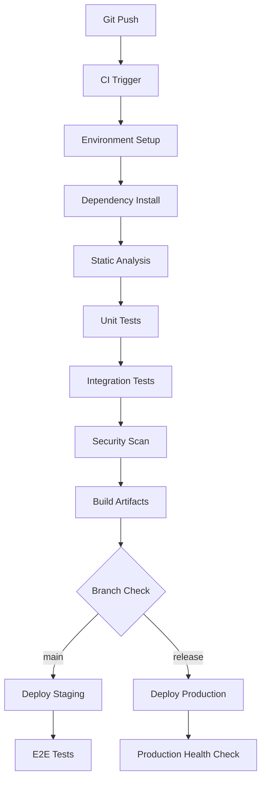

# CI/CD設計

## 概要
PresidioPDFプロジェクトの継続的インテグレーション・継続的デプロイメント（CI/CD）パイプラインを設計する。品質保証、自動テスト、セキュリティチェック、デプロイメント自動化を統合したワークフローを提供する。

## CI/CDアーキテクチャ

### パイプライン概要


## GitHub Actions設定

### メインワークフロー
```yaml
# .github/workflows/ci-cd.yml
name: CI/CD Pipeline

on:
  push:
    branches: [ main, develop, 'release/*' ]
  pull_request:
    branches: [ main, develop ]

env:
  PYTHON_VERSION: '3.11'
  UV_VERSION: '0.1.0'

jobs:
  # 静的解析・テスト
  quality-check:
    name: Quality Assurance
    runs-on: ubuntu-latest
    strategy:
      matrix:
        python-version: ['3.8', '3.9', '3.10', '3.11']
    
    steps:
    - name: Checkout code
      uses: actions/checkout@v4
      
    - name: Set up uv
      uses: astral-sh/setup-uv@v1
      with:
        version: ${{ env.UV_VERSION }}
        
    - name: Set up Python ${{ matrix.python-version }}
      run: uv python install ${{ matrix.python-version }}
      
    - name: Cache dependencies
      uses: actions/cache@v3
      with:
        path: |
          ~/.cache/uv
          .venv
        key: ${{ runner.os }}-uv-${{ matrix.python-version }}-${{ hashFiles('**/pyproject.toml') }}
        restore-keys: |
          ${{ runner.os }}-uv-${{ matrix.python-version }}-
          
    - name: Install dependencies
      run: |
        uv sync --extra dev
        uv run python -m spacy download ja_core_news_sm
        
    - name: Code formatting check
      run: uv run black --check --diff .
      
    - name: Import sorting check
      run: uv run isort --check-only --diff .
      
    - name: Linting
      run: uv run ruff check --output-format=github .
      
    - name: Type checking
      run: uv run mypy src/
      
    - name: Unit tests with coverage
      run: |
        uv run pytest tests/ \
          --cov=src \
          --cov-report=xml \
          --cov-report=term-missing \
          --cov-fail-under=80 \
          --junitxml=pytest-results.xml
          
    - name: Upload coverage to Codecov
      if: matrix.python-version == '3.11'
      uses: codecov/codecov-action@v3
      with:
        file: ./coverage.xml
        flags: unittests
        name: codecov-umbrella
        
    - name: Upload test results
      uses: actions/upload-artifact@v3
      if: always()
      with:
        name: test-results-${{ matrix.python-version }}
        path: pytest-results.xml

  # セキュリティスキャン
  security-scan:
    name: Security Scan
    runs-on: ubuntu-latest
    needs: quality-check
    
    steps:
    - name: Checkout code
      uses: actions/checkout@v4
      
    - name: Set up uv
      uses: astral-sh/setup-uv@v1
      
    - name: Install dependencies
      run: uv sync --extra dev
      
    - name: Security vulnerability scan
      run: uv run safety check --json --output security-report.json
      continue-on-error: true
      
    - name: Dependency license check
      run: uv run pip-licenses --format=json --output-file=license-report.json
      
    - name: SAST with Bandit
      run: uv run bandit -r src/ -f json -o bandit-report.json
      continue-on-error: true
      
    - name: Upload security reports
      uses: actions/upload-artifact@v3
      with:
        name: security-reports
        path: |
          security-report.json
          license-report.json
          bandit-report.json

  # ビルド・アーティファクト作成
  build:
    name: Build Application
    runs-on: ubuntu-latest
    needs: [quality-check, security-scan]
    
    steps:
    - name: Checkout code
      uses: actions/checkout@v4
      
    - name: Set up uv
      uses: astral-sh/setup-uv@v1
      
    - name: Build wheel package
      run: |
        uv build
        
    - name: Build Docker image
      run: |
        docker build -t presidiopdf:${{ github.sha }} .
        docker save presidiopdf:${{ github.sha }} > presidiopdf-image.tar
        
    - name: Upload build artifacts
      uses: actions/upload-artifact@v3
      with:
        name: build-artifacts
        path: |
          dist/
          presidiopdf-image.tar

  # ステージング環境デプロイ
  deploy-staging:
    name: Deploy to Staging
    runs-on: ubuntu-latest
    needs: build
    if: github.ref == 'refs/heads/main' || github.ref == 'refs/heads/develop'
    environment: staging
    
    steps:
    - name: Checkout code
      uses: actions/checkout@v4
      
    - name: Download build artifacts
      uses: actions/download-artifact@v3
      with:
        name: build-artifacts
        
    - name: Configure AWS credentials
      uses: aws-actions/configure-aws-credentials@v2
      with:
        aws-access-key-id: ${{ secrets.AWS_ACCESS_KEY_ID }}
        aws-secret-access-key: ${{ secrets.AWS_SECRET_ACCESS_KEY }}
        aws-region: ap-northeast-1
        
    - name: Deploy to ECS Staging
      run: |
        # ECRにイメージプッシュ
        aws ecr get-login-password | docker login --username AWS --password-stdin $ECR_REGISTRY
        docker load < presidiopdf-image.tar
        docker tag presidiopdf:${{ github.sha }} $ECR_REGISTRY/presidiopdf:staging-${{ github.sha }}
        docker push $ECR_REGISTRY/presidiopdf:staging-${{ github.sha }}
        
        # ECSサービス更新
        aws ecs update-service \
          --cluster presidiopdf-staging \
          --service presidiopdf-staging-service \
          --force-new-deployment
      env:
        ECR_REGISTRY: ${{ secrets.ECR_REGISTRY }}
        
    - name: Run smoke tests
      run: |
        sleep 60  # デプロイ完了待ち
        curl -f ${{ secrets.STAGING_URL }}/health || exit 1

  # E2Eテスト（ステージング環境）
  e2e-tests:
    name: E2E Tests
    runs-on: ubuntu-latest
    needs: deploy-staging
    if: github.ref == 'refs/heads/main'
    
    steps:
    - name: Checkout code
      uses: actions/checkout@v4
      
    - name: Set up Node.js
      uses: actions/setup-node@v3
      with:
        node-version: '18'
        
    - name: Install Playwright
      run: |
        npm install -g @playwright/test
        playwright install
        
    - name: Run E2E tests
      run: |
        playwright test --config=e2e.config.js
      env:
        STAGING_URL: ${{ secrets.STAGING_URL }}
        
    - name: Upload E2E test results
      uses: actions/upload-artifact@v3
      if: always()
      with:
        name: e2e-test-results
        path: test-results/

  # プロダクション環境デプロイ
  deploy-production:
    name: Deploy to Production
    runs-on: ubuntu-latest
    needs: [build, e2e-tests]
    if: startsWith(github.ref, 'refs/heads/release/')
    environment: production
    
    steps:
    - name: Checkout code
      uses: actions/checkout@v4
      
    - name: Download build artifacts
      uses: actions/download-artifact@v3
      with:
        name: build-artifacts
        
    - name: Configure AWS credentials
      uses: aws-actions/configure-aws-credentials@v2
      with:
        aws-access-key-id: ${{ secrets.AWS_ACCESS_KEY_ID }}
        aws-secret-access-key: ${{ secrets.AWS_SECRET_ACCESS_KEY }}
        aws-region: ap-northeast-1
        
    - name: Deploy to ECS Production
      run: |
        # ECRにプロダクション用タグでプッシュ
        aws ecr get-login-password | docker login --username AWS --password-stdin $ECR_REGISTRY
        docker load < presidiopdf-image.tar
        docker tag presidiopdf:${{ github.sha }} $ECR_REGISTRY/presidiopdf:production-${{ github.run_number }}
        docker tag presidiopdf:${{ github.sha }} $ECR_REGISTRY/presidiopdf:latest
        docker push $ECR_REGISTRY/presidiopdf:production-${{ github.run_number }}
        docker push $ECR_REGISTRY/presidiopdf:latest
        
        # ブルーグリーンデプロイメント
        aws ecs update-service \
          --cluster presidiopdf-production \
          --service presidiopdf-production-service \
          --task-definition presidiopdf-production:${{ github.run_number }}
      env:
        ECR_REGISTRY: ${{ secrets.ECR_REGISTRY }}
        
    - name: Health check
      run: |
        for i in {1..30}; do
          if curl -f ${{ secrets.PRODUCTION_URL }}/health; then
            echo "Health check passed"
            exit 0
          fi
          echo "Health check attempt $i failed, waiting..."
          sleep 10
        done
        echo "Health check failed after 30 attempts"
        exit 1
        
    - name: Create GitHub Release
      if: success()
      uses: actions/create-release@v1
      env:
        GITHUB_TOKEN: ${{ secrets.GITHUB_TOKEN }}
      with:
        tag_name: v${{ github.run_number }}
        release_name: Release v${{ github.run_number }}
        draft: false
        prerelease: false
```

## Dockerfile設計

### マルチステージビルド
```dockerfile
# Dockerfile
# ビルドステージ
FROM python:3.11-slim as builder

WORKDIR /app

# システム依存関係
RUN apt-get update && apt-get install -y \
    build-essential \
    curl \
    && rm -rf /var/lib/apt/lists/*

# uvインストール
RUN pip install uv

# 依存関係インストール
COPY pyproject.toml uv.lock ./
RUN uv sync --frozen --no-dev --no-editable

# spaCyモデルダウンロード
RUN uv run python -m spacy download ja_core_news_sm

# プロダクションステージ
FROM python:3.11-slim as production

WORKDIR /app

# ランタイム依存関係
RUN apt-get update && apt-get install -y \
    libgomp1 \
    && rm -rf /var/lib/apt/lists/*

# 非rootユーザー作成
RUN groupadd -r appuser && useradd -r -g appuser appuser

# 仮想環境とアプリケーションファイルコピー
COPY --from=builder /app/.venv /app/.venv
COPY --chown=appuser:appuser src/ /app/src/
COPY --chown=appuser:appuser config/ /app/config/
COPY --chown=appuser:appuser CLAUDE.md /app/

# 実行に必要なディレクトリ作成
RUN mkdir -p /app/outputs /app/web_uploads /app/logs && \
    chown -R appuser:appuser /app

# PATH設定
ENV PATH="/app/.venv/bin:$PATH"
ENV PYTHONPATH="/app"

# ヘルスチェック
COPY healthcheck.py /app/
HEALTHCHECK --interval=30s --timeout=10s --start-period=60s --retries=3 \
    CMD python healthcheck.py

USER appuser

EXPOSE 8080

# Gunicornで本番実行
CMD ["gunicorn", "--bind", "0.0.0.0:8080", "--workers", "4", "--timeout", "120", "src.web_main:app"]
```

## 環境固有設定

### ステージング環境設定
```yaml
# deploy/staging/docker-compose.yml
version: '3.8'

services:
  presidiopdf:
    image: presidiopdf:staging-latest
    ports:
      - "5000:8080"
    environment:
      - PRESIDIO_DEBUG=false
      - PRESIDIO_LOG_LEVEL=INFO
      - PRESIDIO_ENV=staging
      - PRESIDIO_MAX_FILE_SIZE=52428800
    volumes:
      - staging_uploads:/app/web_uploads
      - staging_outputs:/app/outputs
      - staging_logs:/app/logs
    restart: unless-stopped
    healthcheck:
      test: ["CMD", "curl", "-f", "http://localhost:8080/health"]
      interval: 30s
      timeout: 10s
      retries: 3
      start_period: 60s

  nginx:
    image: nginx:alpine
    ports:
      - "80:80"
      - "443:443"
    volumes:
      - ./nginx/staging.conf:/etc/nginx/nginx.conf:ro
      - ./ssl:/etc/ssl:ro
    depends_on:
      - presidiopdf
    restart: unless-stopped

volumes:
  staging_uploads:
  staging_outputs:
  staging_logs:
```

### プロダクション環境設定
```yaml
# deploy/production/docker-compose.yml
version: '3.8'

services:
  presidiopdf:
    image: presidiopdf:production-latest
    deploy:
      replicas: 3
      resources:
        limits:
          cpus: '2.0'
          memory: 2G
        reservations:
          cpus: '1.0'
          memory: 1G
    environment:
      - PRESIDIO_DEBUG=false
      - PRESIDIO_LOG_LEVEL=WARNING
      - PRESIDIO_ENV=production
      - PRESIDIO_MAX_FILE_SIZE=52428800
      - PRESIDIO_SECRET_KEY=${PRESIDIO_SECRET_KEY}
    volumes:
      - production_uploads:/app/web_uploads
      - production_outputs:/app/outputs
      - production_logs:/app/logs
    restart: unless-stopped
    networks:
      - presidio_network

  nginx:
    image: nginx:alpine
    ports:
      - "80:80" 
      - "443:443"
    volumes:
      - ./nginx/production.conf:/etc/nginx/nginx.conf:ro
      - ./ssl:/etc/ssl:ro
    depends_on:
      - presidiopdf
    restart: unless-stopped
    networks:
      - presidio_network

  redis:
    image: redis:alpine
    restart: unless-stopped
    networks:
      - presidio_network
    volumes:
      - redis_data:/data

volumes:
  production_uploads:
  production_outputs:
  production_logs:
  redis_data:

networks:
  presidio_network:
    driver: bridge
```

## 品質ゲート設定

### 品質基準定義
```python
# scripts/quality_gate.py
import json
import sys
from pathlib import Path

class QualityGate:
    def __init__(self):
        self.criteria = {
            'test_coverage': 80.0,
            'max_complexity': 10,
            'max_security_issues': 0,
            'max_license_violations': 0
        }
    
    def check_coverage(self, coverage_file: str) -> bool:
        """テストカバレッジチェック"""
        try:
            with open(coverage_file) as f:
                data = json.load(f)
            
            coverage = data.get('totals', {}).get('percent_covered', 0)
            return coverage >= self.criteria['test_coverage']
        except Exception:
            return False
    
    def check_complexity(self, complexity_file: str) -> bool:
        """循環複雑度チェック"""
        try:
            with open(complexity_file) as f:
                data = json.load(f)
            
            max_complexity = max([item.get('complexity', 0) for item in data])
            return max_complexity <= self.criteria['max_complexity']
        except Exception:
            return False
    
    def check_security(self, security_file: str) -> bool:
        """セキュリティ課題チェック"""
        try:
            with open(security_file) as f:
                data = json.load(f)
            
            issue_count = len(data.get('results', []))
            return issue_count <= self.criteria['max_security_issues']
        except Exception:
            return False
    
    def run_quality_gate(self) -> bool:
        """品質ゲート実行"""
        checks = [
            self.check_coverage('coverage.json'),
            self.check_complexity('complexity.json'),
            self.check_security('bandit-report.json')
        ]
        
        return all(checks)

if __name__ == '__main__':
    gate = QualityGate()
    if not gate.run_quality_gate():
        print("Quality gate failed!")
        sys.exit(1)
    else:
        print("Quality gate passed!")
```

## モニタリング・アラート設定

### GitHub Actions通知設定
```yaml
# .github/workflows/notifications.yml
name: Build Notifications

on:
  workflow_run:
    workflows: ["CI/CD Pipeline"]
    types: [completed]

jobs:
  notify:
    runs-on: ubuntu-latest
    if: ${{ github.event.workflow_run.conclusion != 'success' }}
    
    steps:
    - name: Notify Slack on failure
      uses: 8398a7/action-slack@v3
      with:
        status: failure
        channel: '#presidiopdf-ci'
        webhook_url: ${{ secrets.SLACK_WEBHOOK_URL }}
        fields: repo,message,commit,author,action,eventName,ref,workflow
        
    - name: Create GitHub Issue on failure
      if: github.event.workflow_run.conclusion == 'failure'
      uses: actions/github-script@v6
      with:
        script: |
          github.rest.issues.create({
            owner: context.repo.owner,
            repo: context.repo.repo,
            title: 'CI/CD Pipeline Failed',
            body: `
              ## CI/CD Pipeline Failure
              
              **Workflow**: ${context.payload.workflow_run.name}
              **Branch**: ${context.payload.workflow_run.head_branch}
              **Commit**: ${context.payload.workflow_run.head_sha}
              **Run URL**: ${context.payload.workflow_run.html_url}
              
              Please check the workflow logs for details.
            `,
            labels: ['bug', 'ci/cd']
          })
```

## デプロイメント戦略

### ブルーグリーンデプロイメント
```bash
#!/bin/bash
# scripts/blue_green_deploy.sh

set -e

# 設定
CLUSTER_NAME="presidiopdf-production"
SERVICE_NAME="presidiopdf-production-service"
NEW_IMAGE=$1

if [ -z "$NEW_IMAGE" ]; then
    echo "Usage: $0 <new-image-uri>"
    exit 1
fi

echo "Starting blue-green deployment..."

# 現在のタスク定義取得
CURRENT_TASK_DEF=$(aws ecs describe-services \
    --cluster $CLUSTER_NAME \
    --services $SERVICE_NAME \
    --query 'services[0].taskDefinition' \
    --output text)

echo "Current task definition: $CURRENT_TASK_DEF"

# 新しいタスク定義作成
NEW_TASK_DEF=$(aws ecs describe-task-definition \
    --task-definition $CURRENT_TASK_DEF \
    --query 'taskDefinition' | \
    jq --arg IMAGE "$NEW_IMAGE" '.containerDefinitions[0].image = $IMAGE' | \
    jq 'del(.taskDefinitionArn, .revision, .status, .requiresAttributes, .placementConstraints, .compatibilities, .registeredAt, .registeredBy)')

# 新しいタスク定義登録
NEW_TASK_DEF_ARN=$(echo $NEW_TASK_DEF | aws ecs register-task-definition --cli-input-json file:///dev/stdin --query 'taskDefinition.taskDefinitionArn' --output text)

echo "New task definition: $NEW_TASK_DEF_ARN"

# サービス更新
echo "Updating service..."
aws ecs update-service \
    --cluster $CLUSTER_NAME \
    --service $SERVICE_NAME \
    --task-definition $NEW_TASK_DEF_ARN

# デプロイ完了待ち
echo "Waiting for deployment to complete..."
aws ecs wait services-stable \
    --cluster $CLUSTER_NAME \
    --services $SERVICE_NAME

echo "Blue-green deployment completed successfully!"
```

## ロールバック戦略

### 自動ロールバック設定
```python
# scripts/rollback.py
import boto3
import time
import requests
from typing import Optional

class RollbackManager:
    def __init__(self, cluster_name: str, service_name: str):
        self.ecs_client = boto3.client('ecs')
        self.cluster_name = cluster_name
        self.service_name = service_name
    
    def get_previous_task_definition(self) -> Optional[str]:
        """前回のタスク定義ARN取得"""
        response = self.ecs_client.list_task_definitions(
            familyPrefix=self.service_name,
            status='ACTIVE',
            sort='DESC'
        )
        
        task_definitions = response.get('taskDefinitionArns', [])
        if len(task_definitions) >= 2:
            return task_definitions[1]  # 2番目 = 前回バージョン
        return None
    
    def health_check(self, url: str, timeout: int = 300) -> bool:
        """ヘルスチェック実行"""
        start_time = time.time()
        while time.time() - start_time < timeout:
            try:
                response = requests.get(f"{url}/health", timeout=10)
                if response.status_code == 200:
                    return True
            except requests.RequestException:
                pass
            time.sleep(30)
        return False
    
    def rollback(self, health_check_url: str) -> bool:
        """自動ロールバック実行"""
        print("Health check failed, initiating rollback...")
        
        previous_task_def = self.get_previous_task_definition()
        if not previous_task_def:
            print("No previous task definition found!")
            return False
        
        print(f"Rolling back to: {previous_task_def}")
        
        # サービス更新（ロールバック）
        self.ecs_client.update_service(
            cluster=self.cluster_name,
            service=self.service_name,
            taskDefinition=previous_task_def
        )
        
        # デプロイ完了待ち
        waiter = self.ecs_client.get_waiter('services_stable')
        waiter.wait(
            cluster=self.cluster_name,
            services=[self.service_name]
        )
        
        # ロールバック後のヘルスチェック
        if self.health_check(health_check_url):
            print("Rollback completed successfully!")
            return True
        else:
            print("Rollback failed - service still unhealthy!")
            return False

if __name__ == '__main__':
    import sys
    if len(sys.argv) != 4:
        print("Usage: python rollback.py <cluster> <service> <health_check_url>")
        sys.exit(1)
    
    manager = RollbackManager(sys.argv[1], sys.argv[2])
    success = manager.rollback(sys.argv[3])
    sys.exit(0 if success else 1)
```